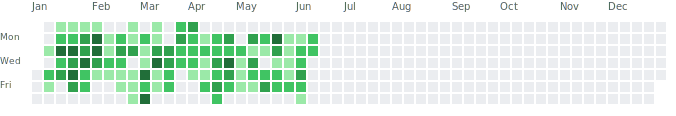
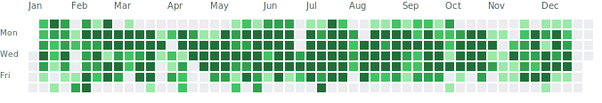
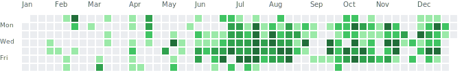

# Hi, I'm Norberto Carosella

Frontend developer based in Auckland, New Zealand. I care about clean product UI,
strong TypeScript, performance, and developer experience.

  
  
  
  

## GitHub Activity

### 2026

  

**2026 so far**

700+ contributions · active most weekdays · mostly private/work repositories

  
Previous years

### 2025

  

3,600+ contributions · 260+ active days · mostly private/work repositories

### 2024

  

1,200+ contributions · 170+ active days · mostly private/work repositories

## What I Work With

  
  
  
  
  
  
  
  

- Building frontend systems with React and TypeScript.
- Turning product requirements into maintainable UI.
- Improving performance, accessibility, and team developer experience.
- Keeping side projects and experiments in my personal repositories.

## Where To Find Me

- Personal GitHub: [@NorbertoC](https://github.com/NorbertoC)
- Work GitHub: [@norbsurvesy](https://github.com/norbsurvesy)
- Website: [norberto.work](https://norberto.work/)
- LinkedIn: [Norberto Carosella](https://www.linkedin.com/in/norberto-carosella87/)

## Profile Setup Notes

To show private contribution blocks on each GitHub profile:

1. Open the profile page for that account.
2. Use **Contribution settings** above the graph.
3. Enable **Private contributions**.
4. Enable **Activity overview** if you want the breakdown by commits, pull
   requests, issues, and code review.

The official GitHub graph remains separate per account. The activity graph above
is a README embed.
